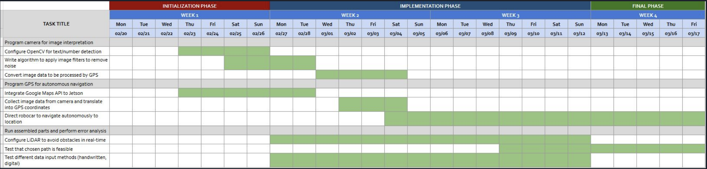

# Team 8 Final Project Proposal

## Team Members

- Youssef Georgy | Electrical & Computer Engineering
- Rizzi Galibut | Mechanical & Aerospace Engineering
- Shuhang Xu | Computer Science
- Kavin Raj | Cognitive Science w/ Emphasis in Machine Learning

Such a lovely team!!

## Project Overall
A waiter-bot that takes visual input from the camera, navigates autonomously to different specified locations (i.e., tables) and then back to the starting point. Use image-detection via camera to give robocar a location or GPS coordinates to navigate  to, then use GPS data to plot path there and avoid any obstacles in the way. The robocar will be able to take any location given (provided it’s in range of the network connection) and determine how to get there

## Physical Setup

## Gantt Chart

## Demonstration

## Using DepthAI for text recognition
**Accomplished:**
- Used DepthAI to enable the camera to detect numbers which are associated with different tables (e.g., 001, 002, etc.) and different CSV files
- Originally started by looking at OpenCV and Tesseract for OCR
- These are not SpatialAI platforms so accomplishing what we were trying to do would be much harder
- Default code provided in DepthAI library launched windows that displayed video stream and words detected, which worked when directly connected to camera through host computer but running code through Jetson would require a container to launch these windows
- Needed to find a way to disable them and have camera run in the background
Default code also rewrote the variable that contained the decoded text each time it detected something
- Had to rewrite and remove sections of the code to stop detection once certain prompts are given
- Light conditions really mattered when showing prompt to camera
- Worked better during the day and when shown prompt on a backlit-screen (with white background)

**What did't work as expected:**
- Camera could read “001” but not “1”, etc., so we decided to use a set of numbers instead
- Number recognition is much more accurate than word recognition so we decided to use numbers as the prompt

## Using GPS to record different paths
- [GPS navigation code](manage.py) is based on the USCD donkeycar GPS library
- We are trying to make it stay in auto-pilot mode by default and reset the origin in the beginning
- Depend on what text is detected with DepthAI, make it move following the pre-recorded path
- When it moves back to the origin, stop and start detecting next text

## Desired but not accomplished
- Include the ability to restart the process once the waiter-bot returned to the starting point without having to manually run the script again
- Have waiter-bot stay at the table for a certain amount of time before returning to the starting point
- Incorporate the LiDAR so the waiter-bot can avoid obstacles (e.g., students walking past) while traveling to tables
- Could also be used to detect when the waiter-bot reaches the table and ensure it doesn’t crash into it
- Have controller inputs programmed in so the waiter-bot can be truly autonomous. 
Currently still requires human input

